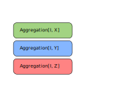
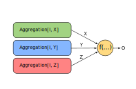
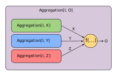

# Composable Stream Aggregations using cats
---
## How I Learned to Stop Worrying and Love the Applicative Functor

---
## Aggregations
- We want to aggregate over streams
    - consume each element
    - produce a value
- First-class citizens
- Composable
- Type-Safe
- Reusable
---
## How do we do it?
- let's use fs2
- Scala 3
- for this example pure aggregations
---
## Aggregation
```Scala
trait Aggregation[TIn, TOut]:
  def start(): Run[TIn, TOut]
...
trait Run[TIn, TOut]:
  def consume(element: TIn): Run[TIn, TOut]
  def result(): TOut
```
---
## How to run it
```Scala
trait Aggregation[TIn, TOut]:
  ...
  def apply[F[_]: Functor](
      stream: Stream[F, TIn]
  )(using Compiler[F, F]): F[TOut] =
    stream.compile
      .fold(start()) { _.consume(_) }
      .map(_.result())
```
---
## Fold
```Scala
object Aggregation:
  ...
  final def fold[TIn, TOut](initial: => TOut)(
      foldStep: (TOut, TIn) => TOut
  ): Aggregation[TIn, TOut] =
    () => FoldRun(initial, foldStep)

  private class FoldRun[TIn, TOut](
      current: TOut,
      foldStep: (TOut, TIn) => TOut
  ) extends Run[TIn, TOut]:
    def consume(element: TIn): Run[TIn, TOut] =
      FoldRun(foldStep(current, element), foldStep)
    def result(): TOut = current
```
---
## We can work with that
```Scala
object Aggregation:
...
  final def count[T]: Aggregation[T, Int] =
    fold(0) { (current, _) => current + 1 }

  final def sum[T: Numeric]: Aggregation[T, T] =
    fold(Numeric[T].zero) { (s, next) => s + next }

  final def foldM[M](using m: Monoid[M]): Aggregation[M, M] =
    fold(m.empty)(m.combine)
```
---
## How do we build on that?
```Scala
object Aggregation:
...
  final def mean[T: Fractional]: Aggregation[T, Option[T]] =
    (sum[T], count[T]) ???
```
- How to combine multiple `Aggregations` ?
---
## Composition

---
## Composition

---
## Composition

---
## How about a `Monad` ?
- A `Functor` is not enough

```Scala
val someAggregation : Aggregation[I, O] = ???
def createDependent(o : O) : Aggregation[I, U] = ???

val composed : Aggregation[I, U] =
  someAggregation.flatMap{ (result : O) =>
    createDependent(result)
  }
```
- `flatMap` implies dependence on earlier result
- but we cant't rewind the stream
---
## `Applicative`
```Scala
trait Applicative[F[_]]:
  ...
  def pure[A](x: A): F[A]

  def ap[A, B](ff: F[A => B])(fa: F[A]): F[B]
```
---
## What the `ap` ?

---
## Function application
- "normal" function application as a function
```Scala
...
def apf[A,B](f: A => B)(a:A):B
def apf[A,B,C](f: (A,B) => C)(a:A, b:B):C
def apf[A,B,C,D](f: (A,B,C) => D)(a:A, b:B, c:C):D
...
```
- that's a lot of overloads
---
## `ap` explained
- arities go away if we use currying
```Scala
def apc[A,B,C](f: A => (B => C))(a : A):(B => C)
```
```Scala
def apc[A,B,C](f: A => B)(a : A): B
```
- `ap` is the same, but in some `F[_]`
```Scala
def ap[A,B,C](f: F[A => B])(a : F[A]): F[B]
```
---
## And some sugar on top
```Scala
val a : F[A] = ???
val b : F[B] = ???
val c : F[C] = ???

def f(a: A, b: B, c: C) : D = ???

val combined1 : F[D] =
  Applicative[F].pure(f.curried).ap(a).ap(b).ap(c)

val combined2 : F[D] = (a, b, c).mapN(f)
```
- `pure` lets us lift some function into `F[_]`
- `ap` applies the function partially
- `mapN` is syntactic sugar
---
## Our Applicative (`pure`)
```Scala
object Aggregation:
  ...
  given [TIn]: Applicative[[TOut] =>> Aggregation[TIn, TOut]] with
    def pure[A](x: A): Aggregation[TIn, A] = () => PureRun(x)
  ...
  private class PureRun[TIn, TOut](fixedResult: TOut)
    extends Run[TIn, TOut]:
    def consume(element: TIn): Run[TIn, TOut] = this
    def result(): TOut = fixedResult
```
---
## Our Applicative (`ap`)
```Scala
object Aggregation:
  ...
  given [TIn]: Applicative[[TOut] =>> Aggregation[TIn, TOut]] with
    ...
    def ap[A, B](left: Aggregation[TIn, A => B])(
        right: Aggregation[TIn, A]
    ): Aggregation[TIn, B] = () =>
      ApRun(left.start(), right.start())
```
---
## Our Applicative (`ApRun`)
```Scala
object Aggregation:
  ...
  private class ApRun[TIn, TIntermediate, TOut](
      left: Run[TIn, TIntermediate => TOut],
      right: Run[TIn, TIntermediate]
  ) extends Run[TIn, TOut]:

    def consume(element: TIn): Run[TIn, TOut] =
      ApRun(
        left.consume(element),
        right.consume(element)
      )

    def result(): TOut =
      left.result()(right.result())
```
---
## Let's use this
```Scala
object Aggregation:
  ...
  final def mean[T: Fractional]: Aggregation[T, Option[T]] =
    (sum[T], count[T]) mapN { (theSum, theCount) =>
      theCount match {
        case 0 => None
        case _ => Some(theSum / Fractional[T].fromInt(theCount))
      }
    }
```
---
## What if things don't fit together?
- our `Applicative` only helps if the input is the same
- typically we don't work with primitives like `Int`
  - we'd like to "drill down"
- we need a functional "adapter" on the input side
- we can define a contravariant functor
  - `Contravariant` in cats
---
## Contravariant (`contramap`)
```Scala
object Aggregation:
  ...
  given [TOut]: Contravariant[[TIn] =>> Aggregation[TIn, TOut]] with
    def contramap[A, B](mapped: Aggregation[A, TOut])(
        f: B => A
    ): Aggregation[B, TOut] = mapped.contramap(f)
...
trait Aggregation[TIn, TOut]:
  ...
  def contramap[B](
      f: B => TIn
  ): Aggregation[B, TOut] = () =>
    Aggregation.ContramapRun(f, start())
```
---
## Contravariant (the Run)
```Scala
object Aggregation:
  ...
  private class ContramapRun[TIn, B, TOut](
      map: TIn => B,
      innerRun: Run[B, TOut]
  ) extends Run[TIn, TOut]:

    def consume(element: TIn): Run[TIn, TOut] =
      ContramapRun(map, innerRun.consume(map(element)))

    def result(): TOut = innerRun.result()
```
---
## Demo Time
In VS Code
---
## Based on a True Story
- I actually did this with Akka streams
    - thin wrapper around `Sink`
- regular updates
    - embedded in a larger Akka Stream
- more elaborate aggregations
    - building quad trees
    - statistics
- extracted a re-occuring pattern into a library
---
## That's all, Folks

https://github.com/SergeantSod/composable-aggregations-example
